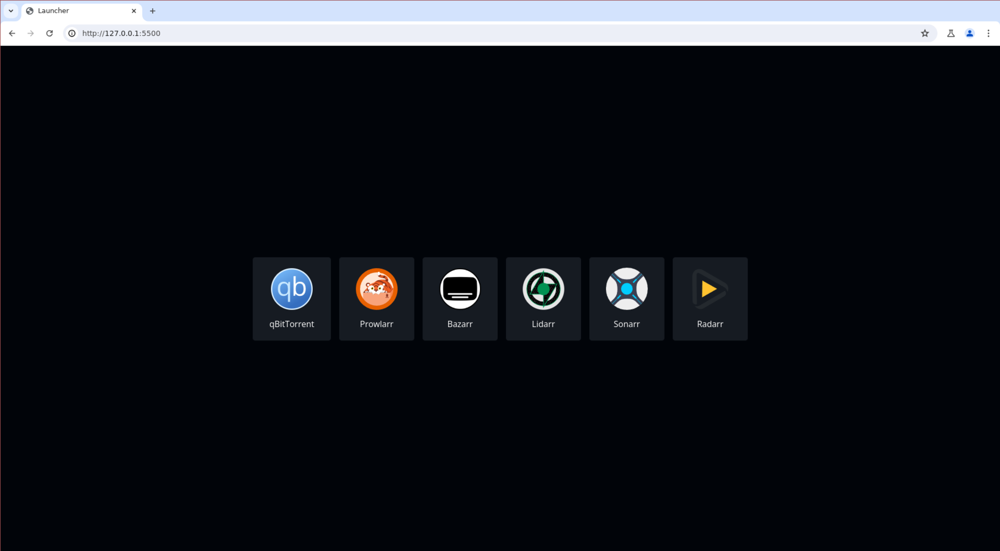

# walauncher

walauncher is a web-based launcher designed as an alternative to [Muximux](https://github.com/mescon/Muximux), primarily used for managing various web services like Servarr apps. However, it can be configured to launch and manage any web application.

## Screenshots


*Home page view*


*In app view*

## Usage

### Using Docker

1. **Create docker-compose.yaml**

   Create a `docker-compose.yaml` file in your project directory:

   ```yaml
   services:
     walauncher:
       image: filiprojek/walauncher:latest
       container_name: walauncher
       ports:
         - 5200:80
       volumes:
         - ./walauncher/config.json:/var/www/html/config.json
         - ./walauncher/img/:/var/www/html/img/
       restart: unless-stopped
   ```

2. **Start and Stop the Compose**

   Start the containers:

   ```bash
   docker-compose up -d
   ```

   Stop the containers:

   ```bash
   docker-compose down
   ```

3. **Configuration**

   - `cd` to a newly created `walauncher` folder
   - Remove the `config.json` folder if it exists.
   - Create a `config.json` file in the project root with the following structure:

     ```json
     {
         "apps": [
             {
                 "name": "Some service",
                 "img": "image_name.jpg",
                 "url": "http://localhost:8000/"
             },
             {
                 "name": "Some service",
                 "img": "image_name.jpg",
                 "url": "http://localhost:8100/"
             }
         ]
     }
     ```

   Replace `"Some service"`, `"image_name.jpg"`, and `"http://localhost:8000/"` with your own service names, image filenames in the `img/` folder, and their respective URLs.

3. **Upload Icons and Images**

   Upload your service icons (`.svg`, `.jpg`, etc.) to the `walauncher/img/` folder.

### Manual Setup (Without Docker)

1. **Setup Web Server**

   Download the repository and serve it using a web server of your choice (e.g., Apache, Nginx).

2. **Configuration**

   - Create a `config.json` file in the project root with the following structure:

     ```json
     {
         "apps": [
             {
                 "name": "Some service",
                 "img": "image_name.jpg",
                 "url": "http://localhost:8000/"
             },
             {
                 "name": "Some service",
                 "img": "image_name.jpg",
                 "url": "http://localhost:8100/"
             }
         ]
     }
     ```

   Replace `"Some service"`, `"image_name.jpg"`, and `"http://localhost:8000/"` with your own service names, image filenames in the `img/` folder, and their respective URLs.

3. **Upload Icons and Images**

   Upload your service icons (`.svg`, `.jpg`, etc.) to the `img/` folder in the project root.

4. **Start the Web Server**

   Once configured, start your web server to serve walauncher.

## Contributing

Contributions are welcome! Fork the repository and submit a pull request with your changes.

## Bug Reporting

If you encounter any bugs or issues, please report them [here](https://github.com/filiprojek/walauncher/issues).

## License

This project is licensed under the GNU General Public License v3.0 (GPL-3.0).

## Docker Image

An official Docker image for walauncher is available on Docker Hub:
[filiprojek/walauncher](https://hub.docker.com/r/filiprojek/walauncher)
